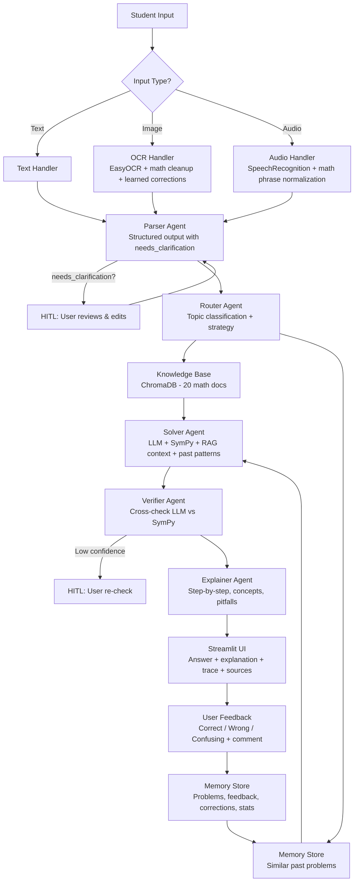

# Math Mentor

A **multimodal AI math tutor** that reliably solves JEE-style math problems using a **multi-agent pipeline**, **RAG over a curated knowledge base**, and **memory-based self-learning**. Accepts **text, image (OCR), and audio (speech-to-text)** input.

---
## Deployed App Link: https://huggingface.co/spaces/itsnaveenkroy/math_mentor
---

## Table of Contents

- [Architecture](#architecture)
- [How It Works](#how-it-works)
- [Multimodal Input & Parsing](#1-multimodal-input--parsing)
- [Parser Agent](#2-parser-agent)
- [RAG Pipeline](#3-rag-pipeline)
- [Multi-Agent System](#4-multi-agent-system)
- [Application UI](#5-application-ui)
- [Human-in-the-Loop (HITL)](#6-human-in-the-loop-hitl)
- [Memory & Self-Learning](#7-memory--self-learning)
- [Tech Stack](#tech-stack)
- [Setup & Run](#setup--run)
- [Deployment](#deployment)
- [Project Structure](#project-structure)
- [Knowledge Base Topics](#knowledge-base-topics)
- [Evaluation Summary](#evaluation-summary)
- [Design Notes](#design-notes)

---

## Architecture



---

## Data Flow Diagram

```
┌─────────────┐
│  User Input  │
│ Text/Image/  │
│    Audio     │
└──────┬───────┘
       │
       ▼
┌──────────────┐
│ Input Handler │  ── image_handler.py (OCR + math cleanup)
│              │  ── audio_handler.py (STT + WAV normalize)
│              │  ── text_handler.py  (validation)
└──────┬───────┘
       │ cleaned text
       ▼
┌──────────────┐
│  HITL Edit   │  User reviews/fixes extracted text
│  (app.py)    │  Corrections saved to memory
└──────┬───────┘
       │ final text
       ▼
┌──────────────────────────────────────────────────────────────────┐
│                     ORCHESTRATOR (orchestrator.py)                │
│                                                                  │
│  ┌──────────┐    ┌──────────┐    ┌──────────┐    ┌──────────┐  │
│  │ 1.PARSER │───▶│ 2.ROUTER │───▶│ 3.SOLVER │───▶│4.VERIFIER│  │
│  │          │    │          │    │          │    │          │  │
│  │ LLM call │    │ LLM call │    │ LLM call │    │ LLM call │  │
│  │ Structures│   │ + RAG    │    │ + SymPy  │    │ Cross-   │  │
│  │ the input│    │ retrieval│    │ compute  │    │ checks   │  │
│  └──────────┘    └────┬─────┘    └────┬─────┘    └──────────┘  │
│                       │               │                │        │
│                  ┌────▼─────┐    ┌────▼─────┐    ┌────▼────┐   │
│                  │ChromaDB  │    │ SymPy    │    │5.EXPLAIN│   │
│                  │(KB search)│   │(math_tools│   │ LLM call│   │
│                  └──────────┘    └──────────┘    └─────────┘   │
│                                                                  │
│  Also: find_similar_problems() from Memory at start              │
│  Also: store_problem() to Memory at end                         │
└──────────────────────────┬───────────────────────────────────────┘
                           │ result dict
                           ▼
                   ┌───────────────┐
                   │  UI Display   │
                   │   (app.py)    │
                   │               │
                   │ • Answer      │
                   │ • Explanation │
                   │ • Steps       │
                   │ • Verification│
                   │ • Concepts    │
                   │ • Agent trace │
                   │ • Feedback    │
                   └───────────────┘
```

---

## How It Works

1. **Accepts input** three ways: typed text, photo/screenshot of a problem (OCR), or audio recording/upload (speech-to-text)
2. **Parses** the input into a structured math problem with topic, variables, constraints, and an ambiguity flag
3. **Routes** to the right solving strategy and retrieves relevant knowledge base context
4. **Solves** using LLM reasoning backed by SymPy computation and similar past problems from memory
5. **Verifies** the solution by cross-checking LLM output against symbolic computation
6. **Explains** with step-by-step reasoning, key concepts, common pitfalls, and related topics
7. **Learns** from user feedback and corrections to improve over time

---

## 1. Multimodal Input & Parsing

### A. Image Input
- Accepts **JPG, PNG, BMP, WEBP** images (photos or screenshots)
- Performs OCR using **EasyOCR** with math-specific post-processing
- Fixes common OCR mistakes: `V(` → `sqrt(`, `~` → `-`, `TT` → `pi`, exponent detection, etc.
- **Shows extracted text to the user before solving** for review
- User can **edit/correct** the extracted text (HITL)
- **OCR confidence** is displayed; HITL is always triggered for math images since OCR struggles with superscripts, fractions, and Greek letters
- **Learned corrections**: past user edits are stored and automatically applied to future OCR outputs

### B. Audio Input
- Accepts **uploaded audio files** (WAV, MP3, M4A, OGG, FLAC, WEBM)
- Supports **microphone recording** directly in the browser via Streamlit
- Speech-to-text via **SpeechRecognition** (Google free API)
- **Math-specific phrase normalization**: "square root of" → `sqrt`, "x squared" → `x^2`, "raised to" → `^`, "times" → `*`, "integral of" → `integrate`, "sine" → `sin`, etc. (30+ phrase mappings)
- Shows transcript to user for confirmation (HITL always triggered)
- Falls back through multiple audio decoding strategies: direct read → stdlib wave → pydub conversion
- **Learned corrections**: past user edits are stored and applied to future transcriptions

### C. Text Input
- Normal typed input with basic validation
- Checks for math-related characters and keywords
- Flags non-math input for review

---

## 2. Parser Agent

The Parser Agent takes raw input (potentially noisy from OCR/audio) and produces a **structured math problem**:

```json
{
  "problem_text": "Solve x^2 - 5x + 6 = 0",
  "problem": "Solve x^2 - 5x + 6 = 0",
  "topic": "algebra",
  "variables": ["x"],
  "constraints": ["x > 0"],
  "given": ["x^2 - 5x + 6 = 0"],
  "find": "values of x",
  "needs_clarification": false
}
```

Key behaviors:
- Cleans OCR/ASR artifacts using LLM reasoning (second pass after rule-based cleanup)
- Classifies problem type: algebra, calculus, probability, linear_algebra, trigonometry, geometry, number_theory
- Extracts **variables**, **constraints**, **given conditions**, and **what to find**
- Sets `needs_clarification = true` when input is ambiguous, incomplete, or unclear → triggers HITL
- Provides `clarification_reason` explaining what's unclear
- Graceful fallback: if LLM fails, uses raw text directly

---

## 3. RAG Pipeline

### Knowledge Base
A curated set of **20 markdown documents** covering JEE-style math topics:
- Math formulas & identities (quadratics, trig, calculus rules, etc.)
- Solution templates and strategies
- Common mistakes & pitfalls
- Unit/domain constraints

### RAG Implementation
- **Chunking**: Markdown documents split on section headers (`##`), with overlap for long sections
- **Embedding**: ChromaDB built-in embedding function (all-MiniLM-L6-v2 via ONNX — no API key needed)
- **Vector Store**: ChromaDB with persistent storage and cosine similarity
- **Retrieval**: Top-k relevant chunks (configurable, default k=5) retrieved for each problem
- **Sources displayed in UI**: Retrieved context shown in an expandable panel with source file names and relevance scores
- **No hallucinated citations**: If retrieval returns nothing, the system does not fabricate references
- Auto-indexes on first run; skips re-indexing if already done

---

## 4. Multi-Agent System

The pipeline runs **5 specialized agents** orchestrated sequentially:

| # | Agent | Role | Input | Output |
|---|-------|------|-------|--------|
| 1 | **Parser Agent** | Converts raw input → structured problem | Raw text + input source | Structured JSON with topic, variables, constraints, needs_clarification |
| 2 | **Router Agent** | Classifies problem type, picks strategy, retrieves KB context | Parsed problem | Topic, strategy, tools_needed, difficulty, KB context chunks |
| 3 | **Solver Agent** | Solves using LLM + SymPy + RAG context + similar past problems | Parsed problem + route info + past problems | Solution, steps, method, confidence, computation result |
| 4 | **Verifier Agent** | Cross-checks solution correctness, validates against SymPy | Parsed problem + solver result | is_correct, confidence, issues, verified_solution |
| 5 | **Explainer Agent** | Produces student-friendly explanation | Parsed problem + solver result + verification | Explanation, key_concepts, common_mistakes, related_topics |

### Agent Orchestration
- **Orchestrator** (`orchestrator.py`) runs the full pipeline with timing and error handling
- Each agent's input/output is recorded in an **agent trace** visible in the UI
- If any agent fails, the pipeline degrades gracefully (fallbacks at every step)
- If parser flags `needs_clarification`, the result is marked for HITL
- If verifier confidence is low (<0.6), the result is flagged for human review
- Similar past problems are retrieved from memory and fed into the Solver for pattern reuse

---

## 5. Application UI

Built with **Streamlit** (`app.py`). Includes:

| Feature | Description |
|---------|-------------|
| **Input mode selector** | Radio buttons: Type it / Upload image / Upload audio |
| **Audio recording** | Record with microphone directly in the browser |
| **Extraction preview** | OCR details (raw + cleaned + confidence) and transcription details in expandable panels |
| **HITL edit box** | Editable text area for user to review and fix OCR/audio output before solving |
| **Agent trace** | Expandable panel showing each agent's input, output, and execution time |
| **Retrieved context panel** | Shows which KB chunks were used, with source names and relevance scores |
| **Final answer + explanation** | Bold answer with method used, followed by detailed explanation |
| **Solution steps** | Expandable step-by-step breakdown |
| **Confidence indicator** | Metric widget showing confidence % with High/Medium/Low label |
| **Re-check button** | When confidence is low, offers a re-solve option |
| **Concepts & tips** | Key concepts, common mistakes to watch out for, related topics |
| **Similar past problems** | Shows previously solved similar problems from memory |
| **Verification notes** | Any issues flagged by the Verifier agent |
| **Feedback buttons** | ✅ "Yes, correct" / ❌ "Wrong answer" / "Confusing explanation" + free-text comment |
| **History sidebar** | Shows per-topic statistics (count, avg confidence) |

---

## 6. Human-in-the-Loop (HITL)

HITL is triggered in these situations:

| Trigger | What Happens |
|---------|-------------|
| **OCR confidence is low** | Extracted text shown in editable text area; user can fix before solving |
| **Audio transcription** | Transcript always shown for review; user edits if needed |
| **Parser detects ambiguity** | `needs_clarification` flag set; warning shown with reason; user can edit input |
| **Verifier not confident** | Low confidence warning displayed; "Request Re-check" button offered |
| **User requests re-check** | Re-check button re-runs the full pipeline |

### HITL Flow
1. **Review**: Human sees the extracted/parsed text and can approve or edit
2. **Correct**: User edits are applied before solving; corrections are **stored in memory** as learning signals
3. **Feedback**: After solving, user can mark as correct/wrong/confusing with optional comments
4. **Memory**: Approved corrections and feedback are stored and used to improve future outputs

### Correction Learning
When a user edits OCR or audio output, the original→corrected pair is saved. On future inputs, these learned corrections are automatically applied before the text reaches the parser, creating a **self-improving input pipeline**.

---

## 7. Memory & Self-Learning

### What Gets Stored

| Data | Storage | Used For |
|------|---------|----------|
| Solved problems (text + solution) | ChromaDB collection | Similarity search for pattern reuse |
| Retrieved KB context sources | ChromaDB metadata | Tracking which knowledge was useful |
| Verifier outcome (correct/confidence/issues) | ChromaDB metadata | Quality tracking |
| User feedback (correct/wrong/confusing + comments) | JSON file (`feedback_log.json`) | Self-learning signals |
| Per-topic statistics (count, avg confidence) | JSON file (`topic_stats.json`) | Adaptive explanations |
| OCR/audio corrections (original → corrected) | JSON file (`corrections_log.json`) | Auto-correction of future inputs |

### Runtime Usage

- **Similar problem retrieval**: Before solving, the system searches memory for similar past problems (cosine similarity > 0.6) and feeds them into the Solver as context for pattern reuse
- **Adaptive explanations**: The Explainer Agent checks topic stats; if the user has struggled with a topic before (low avg confidence), it provides more thorough explanations
- **Auto-correction**: Learned OCR/audio corrections are applied to new inputs automatically
- **History display**: Sidebar shows per-topic performance stats

No model retraining is required — the system improves through **pattern reuse and correction memory**.

---

## Tech Stack

| Component | Technology |
|-----------|-----------|
| **LLM** | Groq API (primary) + Ollama (local fallback) |
| **Model** | `openai/gpt-oss-120b` via Groq (free tier) |
| **Embeddings** | ChromaDB built-in (all-MiniLM-L6-v2 via ONNX, no API key) |
| **Vector Store** | ChromaDB (persistent, cosine similarity) |
| **Math Engine** | SymPy (symbolic computation, equation solving, calculus, linear algebra) |
| **OCR** | EasyOCR with math-specific post-processing |
| **Speech-to-Text** | SpeechRecognition (Google free API) |
| **Audio Decoding** | pydub + stdlib wave (multi-strategy fallback) |
| **UI** | Streamlit |
| **Memory** | ChromaDB (similarity search) + JSON files (feedback, stats, corrections) |

---

## Setup & Run

### Prerequisites
- Python 3.9+
- (Optional) [Ollama](https://ollama.ai) for local LLM fallback
- (Optional) ffmpeg for non-WAV audio file support

### 1. Clone and install

```bash
cd math_mentor
pip install -r requirements.txt
```

### 2. Configure environment

Copy `.env.example` to `.env` and add your Groq API key:

```bash
cp .env.example .env
# edit .env and set GROQ_API_KEY
```

Get a free key at [console.groq.com](https://console.groq.com/).

**`.env.example` contents:**
```
GROQ_API_KEY=your-groq-api-key-here
GROQ_MODEL=openai/gpt-oss-120b
OLLAMA_BASE_URL=http://localhost:11434/v1
OLLAMA_MODEL=llama3.2
CHROMA_PERSIST_DIR=./data/chroma_db
MEMORY_PERSIST_DIR=./data/memory
MAX_RETRIEVAL_K=5
CONFIDENCE_THRESHOLD=0.7
```

### 3. (Optional) Ollama fallback

If you want a local LLM fallback when Groq is unavailable:

```bash
# install ollama from https://ollama.ai
ollama pull llama3.2
```

### 4. Run

```bash
streamlit run app.py
```

The app will open in your browser at `http://localhost:8501`.

---

## Deployment

The app is designed for easy deployment to **Streamlit Cloud**:

1. Push the repo to GitHub
2. Go to [share.streamlit.io](https://share.streamlit.io)
3. Connect your GitHub repo, set `app.py` as the main file
4. Add `GROQ_API_KEY` in the Streamlit Cloud secrets settings
5. `packages.txt` provides system-level dependencies (`libgl1-mesa-glx`, `libglib2.0-0`) needed for EasyOCR

Also deployable to: **HuggingFace Spaces**, **Render**, **Railway**.

---

## Project Structure

```
math_mentor/
├── app.py                          # Streamlit frontend (UI + HITL + feedback)
├── .env.example                    # Environment variable template
├── requirements.txt                # Python dependencies
├── packages.txt                    # System dependencies (for Streamlit Cloud)
├── pyproject.toml                  # Project metadata
├── agents/
│   ├── orchestrator.py             # Pipeline orchestration with timing + error handling
│   ├── parser_agent.py             # Raw input → structured problem (with needs_clarification)
│   ├── router_agent.py             # Topic classification + strategy + KB retrieval
│   ├── solver_agent.py             # LLM + SymPy + RAG context + past patterns
│   ├── verifier_agent.py           # Cross-checks solution, flags issues
│   └── explainer_agent.py          # Student-friendly explanation + concepts + tips
├── input_handlers/
│   ├── text_handler.py             # Text validation and math detection
│   ├── image_handler.py            # EasyOCR + math cleanup + learned corrections
│   └── audio_handler.py            # SpeechRecognition + math phrase normalization + learned corrections
├── rag/
│   ├── embeddings.py               # ChromaDB default embeddings wrapper
│   ├── knowledge_base.py           # Indexes markdown docs into ChromaDB
│   └── retriever.py                # Semantic search over knowledge base
├── memory/
│   └── memory_store.py             # Problem storage, feedback, corrections, topic stats
├── utils/
│   ├── config.py                   # Loads .env, central configuration
│   ├── llm.py                      # LLM client (Groq + Ollama fallback, JSON repair)
│   └── math_tools.py               # SymPy computation tools (solve, diff, integrate, limit, etc.)
├── knowledge_base/                 # 20 curated JEE math topic markdown files
│   ├── algebra_quadratic.md
│   ├── algebra_polynomials.md
│   ├── algebra_sequences.md
│   ├── algebra_logarithms.md
│   ├── algebra_inequalities.md
│   ├── algebra_systems.md
│   ├── calculus_limits.md
│   ├── calculus_derivatives.md
│   ├── calculus_integration.md
│   ├── calculus_optimization.md
│   ├── linear_algebra_matrices.md
│   ├── linear_algebra_determinants.md
│   ├── linear_algebra_vectors.md
│   ├── probability_basics.md
│   ├── probability_combinatorics.md
│   ├── probability_distributions.md
│   ├── trigonometry_formulas.md
│   ├── common_mistakes.md
│   ├── solution_templates.md
│   └── domain_constraints.md
└── data/
    ├── chroma_db/                  # Persisted ChromaDB vector store
    └── memory/                     # Persisted memory data
        ├── topic_stats.json        # Per-topic performance stats
        ├── feedback_log.json       # User feedback log
        ├── corrections_log.json    # OCR/audio correction pairs
        └── chroma/                 # Problem memory vector store
```

---

## Knowledge Base Topics

20 curated documents covering JEE math scope:

| Category | Topics |
|----------|--------|
| **Algebra** | Quadratics, polynomials, sequences & series, logarithms, inequalities, systems of equations |
| **Calculus** | Limits, derivatives, integration, optimization |
| **Linear Algebra** | Matrices, determinants, vectors |
| **Probability** | Basics, combinatorics, distributions |
| **Trigonometry** | Formulas and identities |
| **Cross-cutting** | Common mistakes reference, solution templates, domain constraints |

---

## Evaluation Summary

### Requirements Compliance

| Requirement | Status | Implementation |
|-------------|--------|----------------|
| **Image input (OCR)** | ✅ | EasyOCR with math-specific post-processing, learned corrections |
| **Audio input (ASR)** | ✅ | SpeechRecognition + microphone recording + file upload |
| **Text input** | ✅ | Direct text area with validation |
| **Parser Agent** | ✅ | Structured output with needs_clarification, constraints, topic |
| **Router Agent** | ✅ | Topic classification, strategy, tool selection, KB retrieval |
| **Solver Agent** | ✅ | LLM + SymPy + RAG context + similar past problems |
| **Verifier Agent** | ✅ | Cross-checks LLM vs SymPy, flags issues |
| **Explainer Agent** | ✅ | Step-by-step explanation, concepts, pitfalls, adaptive to history |
| **RAG Pipeline** | ✅ | 20 docs → chunk → embed → ChromaDB → top-k retrieval |
| **Sources in UI** | ✅ | Retrieved context panel with source names and relevance |
| **HITL: OCR/ASR low confidence** | ✅ | Always shows editable preview for image/audio |
| **HITL: Parser ambiguity** | ✅ | needs_clarification triggers warning + edit |
| **HITL: Verifier unsure** | ✅ | Low confidence warning + re-check button |
| **HITL: User re-check** | ✅ | Re-check button re-runs pipeline |
| **HITL: Corrections stored** | ✅ | Edits saved as learning signals |
| **Memory: Store full data** | ✅ | Problem, solution, context, verifier outcome, feedback |
| **Memory: Similar problems** | ✅ | ChromaDB similarity search, fed into solver |
| **Memory: Reuse patterns** | ✅ | Past solutions provided to solver as context |
| **Memory: Correction rules** | ✅ | OCR/audio corrections auto-applied to new inputs |
| **Confidence indicator** | ✅ | Metric widget with High/Medium/Low label |
| **Agent trace** | ✅ | Expandable panel with per-agent timing and I/O |
| **Feedback buttons** | ✅ | Correct / Wrong / Confusing + free-text comment |
| **`.env.example`** | ✅ | All config variables with defaults |
| **Architecture diagram** | ✅ | Mermaid diagram in README |
| **Streamlit UI** | ✅ | Full-featured with sidebar, expanders, feedback |
| **Deployable** | ✅ | Streamlit Cloud ready (packages.txt + requirements.txt) |

### Strengths
- **Robust LLM handling**: JSON extraction with truncation repair, markdown fence stripping, regex fallback
- **Free to run**: Uses Groq free tier model + free embeddings (no paid APIs required)
- **Graceful degradation**: Every agent has fallbacks if LLM fails; Ollama as secondary LLM
- **Computational verification**: SymPy backs up LLM answers for equations, derivatives, integrals, limits, matrices
- **Self-learning loop**: Feedback + corrections + topic stats create continuous improvement without retraining

---

## Design Notes

- The LLM client has robust JSON extraction for models that may not support `response_format={"type":"json_object"}`: strips markdown fences, regex-finds JSON blocks, repairs truncated output by closing unclosed strings/brackets
- OCR for math is inherently noisy — the image handler has aggressive post-processing for common OCR mistakes, plus the Parser Agent does a second LLM-based cleanup pass
- Audio math input works best for simple problems; complex notation is better typed or photographed
- Memory keeps the last 500 feedback entries and 200 correction pairs to bound storage
- ChromaDB is used for both the knowledge base and problem memory, with separate collections
